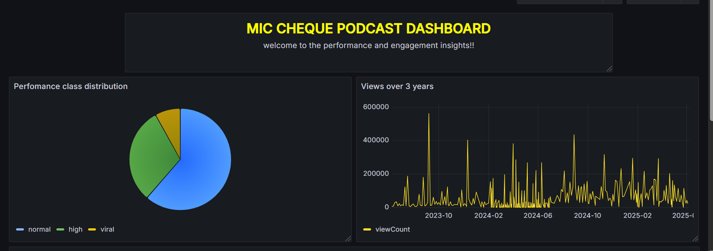

# 🎥 YouTube Data Pipeline with Apache Airflow, PostgreSQL, and Grafana

## 📌 Project Description

This project implements a robust **end-to-end data pipeline** that automates the extraction, transformation, and visualization of data from a curated list of **YouTube podcast videos** (e.g., Mic Cheque Podcast). The primary goal is to track video performance over time and generate insights like engagement rate, view trends, and performance classification using scheduled tasks and modern data engineering tools.

---

## 🚀 Key Features

* **Data Extraction:** Uses YouTube Data API to fetch video metadata (title, publish date, viewCount, likeCount, etc.).
* **Data Transformation:** Enriches data with new features (engagement rate, performance classification, date/time parts).
* **Data Loading:** Writes the enriched data into a **PostgreSQL** database hosted on **Aiven**, using Spark.
* **Scheduling & Automation:** Orchestrated via **Apache Airflow** using the PythonOperator for modular task execution.
* **Visualization:** Interactive dashboards in **Grafana** showing:

  * Performance class distribution (pie chart)
  * Views over time (line chart)
  * Engagement rate per video (bar chart)

---

## 🛠️ Tech Stack

* **Python**
* **Apache Airflow** – DAG-based pipeline orchestration
* **Apache Spark** – Data enrichment & transformation
* **PostgreSQL (Aiven)** – Cloud-hosted relational storage
* **DBeaver** – SQL client for inspection/debugging
* **Grafana** – Real-time visualization and dashboarding

---
## 📊 Grafana Dashboard

Here's a sample of the YouTube Podcast Analytics Dashboard visualized in Grafana:

